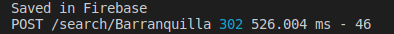

# Backend Node - Firebase

## Introduction:

This in an excersite to improve my backend skills. 

CRUD Web App using Nodejs, Firebase Realtime Database and express.

## Environment variables

This Credentilas are important. Beacuse you will working with the Twitter API and Firebase Database. 
So you must to haver developer accounts in boths applications. And cofirgure them properly.

#### <li>GOOGLE_APPLICATION_CREDENTIALS</li>
#### <li>TWITTER API CREDENTIALS</li>

## Starting

You have to create your own development acount to use Twitter API to get your credentials to connect with the Twitter API or if you have one yet is ok.

You can do this falllowing [this](https://developer.twitter.com/en) link.

The same with Firebase you must have an acount as developer from Google Cloud Plataform. You can login in with you gmail acount. [Here](https://developers.google.com/) is the link.

## Requeriments

### NodeJS principal packets

#### <li> express</li>
#### <li> express-handelbar</li>
#### <li> dotenv</li>
#### <li> firebase-admin</li>
#### <li> twit</li>
#### <li> twittter</li>

## starting the Server

npm run dev

</img>

## App in the localhost

</img>

## Searching a word

</img>

When you are searching a word, this word is passed dynamically as a parameter to the API route and it reponds with the last five tweets. This tweets, first are saved in `firebase data base` and then they are called from de App.

</img>

## The data is saved in DB Firebase, it is a No SQL DB

</img>

## We recover the data with the GET method from de DB

</img>

## You can delete all again pushing DELETE button.

</img>

The data is gone!

## We adding a new functionality time_line with a new searcher

It works with the screen_name parameter from twitter. If you know the screen_name of any user. You can use this parameter and search the last five twits from this user.

</img>

For example we used a well-known media company as BluRadio.

</img>

See you next!

