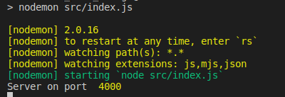

# Backend Node - Firebase

## Introduction:

This in an excersite to improve my backend skills. 

CRUD Web App using Nodejs, Firebase Realtime Database and express.

## Environment variables

#### <li>GOOGLE_APPLICATION_CREDENTIALS</li>
#### <li>TWITTER API CREDENTIALS</li>

## Starting

You have to create your own development acount to use Twitter API to get your credentials to connect with the Twitter API or if you have one yet is ok.

You can do this falllowing [this](https://developer.twitter.com/en) link.

The same with Firebase you must have an acount as developer from Google Cloud Plataform. You can login in with you gmail acount. [Here](https://developers.google.com/) is the link.

## Requeriments

### NodeJS principal packets

#### <li> express</li>
#### <li> express-handelbar</li>
#### <li> dotenv</li>
#### <li> firebase-admin</li>
#### <li> twit</li>

## starting the Server

npm run dev

</img>

## App in the localhost

</img>

## Searching a word

</img>

## The Twitter API Response

</img>

## The data is saved in DB Firebase, it is a No SQL DB

</img>

## You can delete all again pushing DELETE button.

</img>

The data is gone!

See you next!

